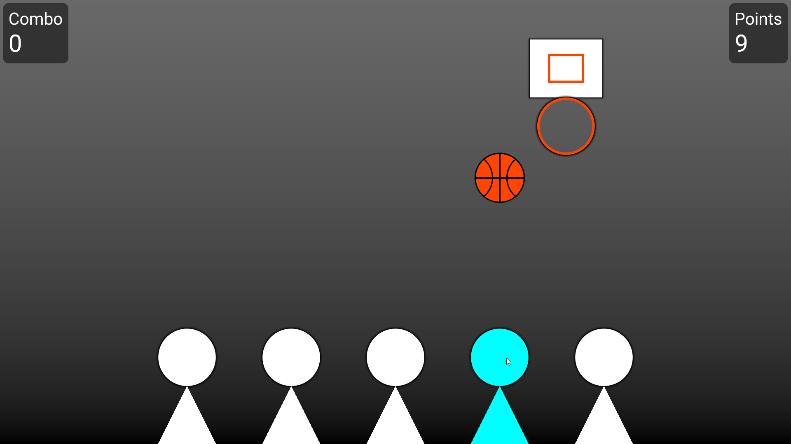

<p align="center">
  
</p>

# Basketball Barrage

 A *WIP* game based off of [TouchMaster](https://en.wikipedia.org/wiki/TouchMaster) Hot Hoops using [osu!framework](https://github.com/ppy/osu-framework)



## Missing features

- original gameplay
    - two players
    - random +10 targets
    - coloured judgements

## Releases

The following command is used to make the binaries:

```shell
dotnet publish BasketballBarrage.Desktop -r win-x64 -c Release --self-contained true /p:PublishSingleFile=true /p:IncludeAllContentForSelfExtract=true /p:PublishTrimmed=true
```

The generated `publish` folder is renamed to `Basketball Barrage` and then zipped to `basketball-barrage-{version}.zip`. While the framework is capable of cross-platform, there are only Windows-only releases for now until I learn how to make the binaries for other platforms.
